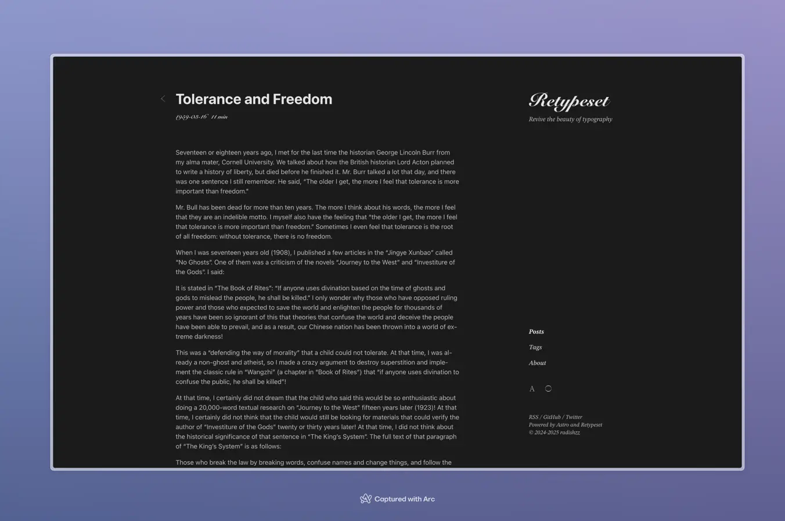

> [Retypeset](https://github.com/radishzzz/astro-theme-retypeset) 是一款基于 [Astro](https://astro.build/) 框架的静态博客主题，中文名为重新编排。

## 主题配置

配置文件 `📄 src/config.ts` 自定义：

- 站点信息
- 主题配色
- 全局设置
- 评论系统
- 搜索引擎优化
- 自定义页脚
- 资源预加载

配置文件 `📄 astro.config.ts` 自定义：语法高亮

配置文件 `📄 src/utils/description.ts` 自定义：文章摘要

配置文件 `📄 src/pages/og/[...image].ts` 自定义：Open Graph 社交卡片

xsl 文件 `📄  public/feeds/xxx-style.xsl` 自定义：RSS 订阅页颜色

### 站点配置

```ts
site: {
  // 站点标题
  title: ''
  // 站点副标题
  subtitle: ''
  // 站点描述
  description: ''
  // 开启状态下，将上方静态配置
  // 使用 src/i18n/ui.ts 中的多语言标题/副标题/站点描述
  i18nTitle: true // true | false
  // 作者名称
  author: ''
  // 站点地址
  url: ''
  // 基础路径
  // 所有页面和资产的根目录
  base: '/' // 例如 '/blog', '/docs'
  // 站点图标
  // 推荐格式：svg, png, ico
  // '/icons/favicon.svg' 或 'https://example.com/favicon.svg'
  favicon: ''
}
```

---

## 使用说明

如何优雅的输出内容？

### 创建新文章

执行 `pnpm new-post <filename>` 创建新文章，可在 `src/content/posts/` 目录中编辑。

```bash
pnpm new-post                      ->  src/content/posts/new-post.md
pnpm new-post first-post           ->  src/content/posts/first-post.md
pnpm new-post 2025/03/first-post   ->  src/content/posts/2025/03/first-post.md
pnpm new-post first-post.mdx       ->  src/content/posts/first-post.mdx
```

### 文章配置（Front Matter）

`title` 和 `published` 为必填项，其余配置均可删除。

```md
---
# 必填
title: Front Matter
published: 2020-01-16

# 可选
description: 没有的时候，会根据配置文件自动会截取。
updated: 2020-01-16
tags:
  - Front Matter
  - 使用说明

# 可选，进阶
draft: false
pin: 99
toc: true
lang: zh
abbrlink: theme-guide
---
```

### 可选部分说明

#### draft

是否标记文章为草稿。设为 `true` 时无法发布文章，仅供本地开发预览。默认为 `false`

#### pin

是否置顶文章。数字越大，文章的置顶优先级越高。默认为 `0`，即不置顶。

#### toc

是否生成目录。显示 `h2` 至 `h4` 标题。默认由全局配置项 `global.toc` 决定，可在文章中单独设置以覆盖全局配置。

#### lang

`de/en/es/fr/ja/ko/pl/pt/ru/zh/zh-tw`

指定文章语言。只能指定一种语言，不指定则默认显示在所有语言路径下。

官方使用里有详细说明。

#### abbrlink

自定义文章 URL。只能包含小写字母、数字和连字符 `-`。

#### 其他

执行 `pnpm format-posts`，可优化 `src/content/` 目录中 Markdown 文件的排版格式。

在 CJK（中文、日文、韩文）与英文混写的场景下，补充正确的空格，纠正标点符号等。

其他细节请参阅主题作者写的文章 [主題上手指南](https://retypeset.radishzz.cc/zh-tw/posts/theme-guide/)

---

## Markdown 扩展语法

:::warning[注意]
主要用于本主题，其他主题大概率不通用。

以下内容仅为我自己会常用的部分，全部扩展语法，请参阅主题作者。
:::

### 图注

使用标准的 Markdown 图像语法 ``，即可自动生成图注。在 `alt` 前添加下划线 `_` 或留空 `alt`，即可隐藏图注。

本地图片资源可以放在同级目录 `../posts/_images/1-dark.jpeg` 下，然后用 `` 的方式引用。



#### 语法

```md


```

### 提示块

使用 GitHub 语法 `> [!TYPE]` 或三冒号语法 `:::type`，即可创建提示块。

支持 `note`、`tip`、`important`、`warning`、`caution` 五种类型。

#### 语法

```md
> [!NOTE]
> 即使快速浏览，也值得用户留意的信息。

> [!TIP]
> 可选信息，可帮助用户更轻松地完成操作。

> [!IMPORTANT]
> 用户成功所需的关键信息。

:::warning
由于存在潜在风险，需要用户立即关注的关键内容。
:::

:::caution
某些操作可能带来的负面后果。
:::

:::note[自定义标题]
这是一个自定义标题的提示块。
:::
```

#### 效果

> [!NOTE]
> 即使快速浏览，也值得用户留意的信息。

> [!TIP]
> 可选信息，可帮助用户更轻松地完成操作。

> [!IMPORTANT]
> 用户成功所需的关键信息。

:::warning
由于存在潜在风险，需要用户立即关注的关键内容。
:::

:::caution
某些操作可能带来的负面后果。
:::

:::note[自定义标题]
这是一个自定义标题的提示块。
:::

### 折叠块

使用三冒号语法 `:::fold[title]`，即可创建折叠块。点击标题可以展开或收起。

#### 语法

```md
:::fold[使用提示]
如果需要添加并非所有读者都会感兴趣的内容，可以将其放在折叠块中。
:::
```

#### 效果

:::fold[点击展开]
如果需要添加并非所有读者都会感兴趣的内容，可以将其放在折叠块中。
:::

### 画廊

使用三冒号语法 `:::gallery`，即可创建图片画廊。水平滚动以查看更多图片。

#### 语法

```md
:::gallery


:::
```

#### 效果

:::gallery


:::

### GitHub 仓库

使用双冒号语法 `::github{repo="owner/repo"}`，即可嵌入 GitHub 仓库。

#### 语法

```md
::github{repo="yangtudou/astro-blog"}
```

#### 效果

::github{repo="yangtudou/astro-blog"}

### 视频

使用双冒号语法 `::youtube{id="video-id"}`，即可嵌入视频。

#### 语法

```md
::youtube{id="9pP0pIgP2kE"}

::bilibili{id="BV1sK4y1Z7KG"}
```

#### 效果

::youtube{id="9pP0pIgP2kE"}

::bilibili{id="BV1sK4y1Z7KG"}

### Spotify

使用双冒号语法 `::spotify{url="spotify-url"}`，即可嵌入 Spotify 内容。

#### 语法

```md
::spotify{url="https://open.spotify.com/track/0HYAsQwJIO6FLqpyTeD3l6"}

::spotify{url="https://open.spotify.com/album/03QiFOKDh6xMiSTkOnsmMG"}
```

#### 效果

::spotify{url="https://open.spotify.com/track/0HYAsQwJIO6FLqpyTeD3l6"}

::spotify{url="https://open.spotify.com/album/03QiFOKDh6xMiSTkOnsmMG"}

### X 推文

使用双冒号语法 `::tweet{url="tweet-url"}`，即可嵌入 X 推文。

#### 语法

```md
::tweet{url="https://x.com/hachi_08/status/1906456524337123549"}
```

#### 效果

::tweet{url="https://x.com/hachi_08/status/1906456524337123549"}

### CodePen

使用双冒号语法 `::codepen{url="codepen-url"}`，即可嵌入 CodePen 演示。

#### 语法

```
::codepen{url="https://codepen.io/jh3y/pen/NWdNMBJ"}
```

#### 效果

::codepen{url="https://codepen.io/jh3y/pen/NWdNMBJ"}
